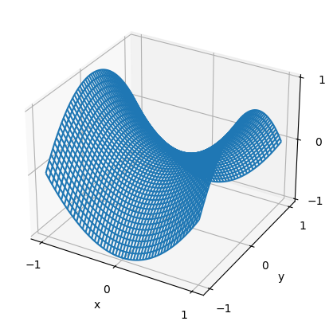
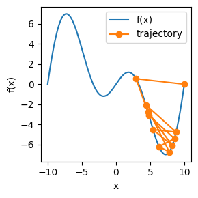

# 📘 Optimization Fundamentals — From Minimization to Algorithms

This repository contains a two-part, hands-on introduction to optimization.  
It is designed as a gentle, visual, and practical guide for anyone learning how machine-learning optimization works under the hood.

---

## 🚀 Contents

|  | 
### 📗 Part 1 — Introduction to Minimization  
**File:** `Part1-Introduction-to-minimization.ipynb`  

This notebook introduces the foundational ideas behind optimization:

- What is **risk** and **empirical risk**?  
- The difference between **local minima**, **global minima**, and **saddle points**  
- Intuitive, visual explanations of optimization landscapes  
- Simple examples that show why minimization is challenging  
- Graphical demonstrations to build intuition  

If you’re new to optimization, _start here_. |
|---|---|

---

|  | 
### 📘 Part 2 — Optimization Algorithms  
**File:** `part2-optimization-algorithms.ipynb`  

This notebook explores *how* minimization is actually carried out:

- Gradient Descent  
- Stochastic Gradient Descent (SGD)  
- Momentum  
- RMSProp, Adam, and other adaptive optimizers  
- Visual comparisons of algorithm behavior  
- Trade-offs: speed, stability, convergence quality  

The notebook blends theory with practical examples. |
|---|---|

---

## 🧠 What You’ll Learn

By working through these notebooks, you will:

- Understand how optimization fits into machine learning  
- Build intuition about loss landscapes  
- Learn why simple algorithms sometimes fail  
- Compare classical and modern optimization methods  
- Gain practical experience running and visualizing optimizers  

---
